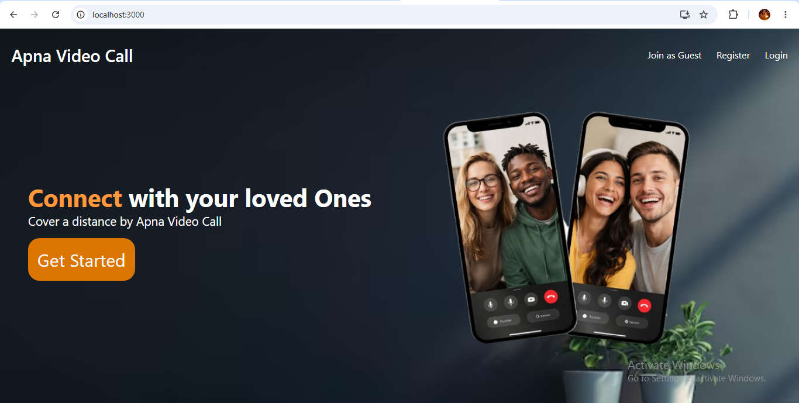
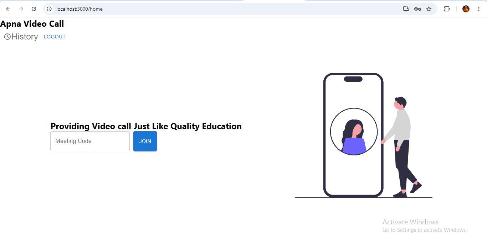
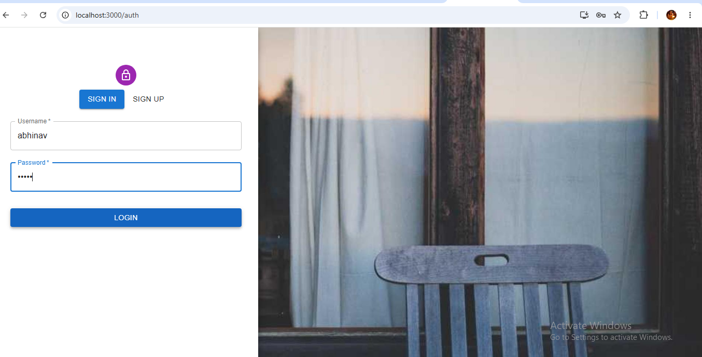
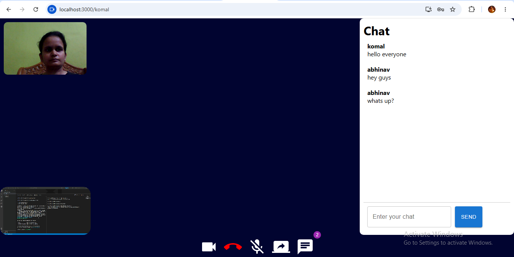

# Apna Video Call

## 🔗 Live Demo

https://apnavideocallfrontend-wdy3.onrender.com

A full-stack real-time video conferencing web application that enables users to communicate through live video, audio, and instant messaging. Users can create accounts, join meetings, interact with multiple participants simultaneously, and access their meeting history. The application is built using WebRTC for peer-to-peer media streaming and Socket.io for real-time communication.

### Home Page



## 🚀 Features

### Authentication
- User Signup
- User Login
- Secure password hashing using Bcrypt
- Session-based authentication

### Video Conferencing
- Real-time video calling
- Multiple participants in a single room
- Peer-to-peer media streaming using WebRTC
- Live room joining and leaving

### Audio & Video Controls
- Mute / Unmute microphone
- Turn Camera On / Off
- Real-time media control updates

### Real-Time Chat
- In-meeting chat functionality
- Instant message delivery using Socket.io
- Multi-user communication support

### Meeting Management
- Meeting history tracking
- Access previous meeting records
- User-specific meeting data storage

### User Experience
- Fully responsive interface
- Clean and modern UI
- Pure CSS styling
- Fast and interactive experience

---

## 🛠️ Tech Stack

### Frontend
- React.js
- HTML5
- CSS3
- Axios

### Backend
- Node.js
- Express.js

### Database
- MongoDB

### Real-Time Communication
- WebRTC
- Socket.io

### Authentication & Security
- Bcrypt

---

## ⚙️ Installation

### 1. Clone the Repository

```bash
git clone https://github.com/sharmakomal1995/Apna-Video-Call.git
```

### 2. Navigate to Project Directory

```bash
cd Apna-Video-Call
```

### 3. Install Backend Dependencies

```bash
cd backend
npm install
```

### 4. Install Frontend Dependencies

```bash
cd ../frontend
npm install
```

### 5. Create Environment Variables

Create a `.env` file inside the `backend` folder.

```env
PORT=8000

MONGO_URI=your_mongodb_connection_string

JWT_SECRET=your_secret_key
```

### 6. Start Backend Server

Open a terminal and run:

```bash
cd backend
node src/app.js
```

### 7. Start Frontend Application

Open another terminal and run:

```bash
cd frontend
npm start
```

### 8. Open Application

Visit:

```text
http://localhost:3000
```
## 📖 Usage

1. Register a new account.
2. Login to the application.
3. Create or join a meeting room.
4. Enable camera and microphone permissions.
5. Communicate with participants through:
   - Live Video
   - Audio
   - Real-Time Chat
6. Access meeting history anytime.

---

## 🔒 Security Features

- Password hashing with Bcrypt
- Protected routes
- Secure authentication flow
- Environment variable protection

---

## 🌟 Future Enhancements

- Screen Sharing
- Meeting Recording
- File Sharing
- Virtual Backgrounds
- Participant Management
- Notifications
- Email Invitations

---

## 📸 Screenshots

### Landing Page



### Authentication Page



### Video Call & Chat Interface



---

## 👩‍💻 Author

**Komal Sharma**

Full Stack Web Developer

GitHub: https://github.com/sharmakomal1995/Apna-Video-Call/

LinkedIn: https://www.linkedin.com/in/komal-sharma-35aa6a178/

---

## 📄 License

This project is developed for educational and portfolio purposes.
